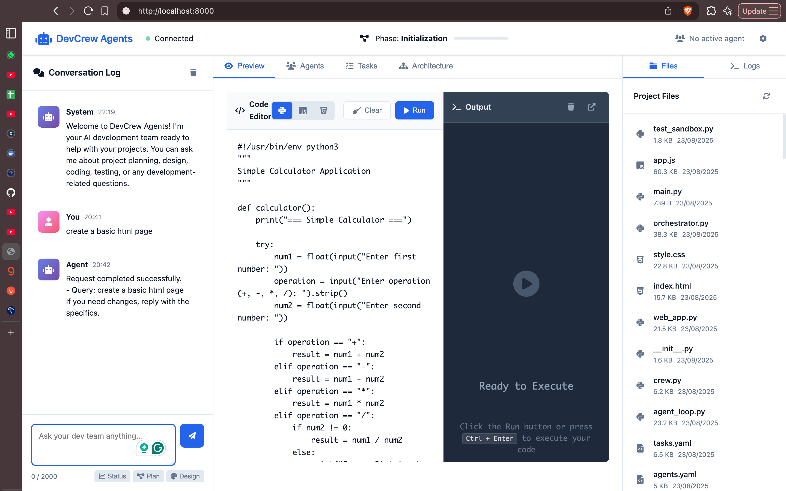

# DevCrew-Agents

Multi‑agent development team with a real‑time web interface.

DevCrew‑Agents simulates a software development team using four specialized agents (Project Manager, Designer, Coder, Tester) orchestrated by a central controller. It ships with a FastAPI web app, live WebSocket updates, an in‑browser code sandbox (Python/JavaScript/HTML), shared memory, a message bus, and automatic surfacing of generated code to the UI.




## Highlights

- Multi‑agent crew (PM, Designer, Coder, Tester) with clear roles and tools
- PM‑first orchestration and dependency‑aware task pipeline
- Real‑time web UI (FastAPI + WebSocket) with:
  - Chat and conversation history
  - Project overview, agents, tasks, and architecture tabs
  - File browser and system logs
  - Code sandbox (Python, JavaScript via Node.js, HTML) with Ctrl/Cmd+Enter
  - One‑click "maximize sandbox" to a new tab
- Shared memory and message bus for agent coordination
- Generated code is published to the sandbox automatically
- Configurable via YAML (agents.yaml, tasks.yaml)


## Architecture Overview

- Backend: FastAPI application (src/web_app.py) serving static assets and APIs
- Orchestrator: AgentOrchestrator (src/orchestrator.py) manages phases, task queue, and agent turns
- Agents: Defined/configured via YAML (src/config/agents.yaml, src/config/tasks.yaml); tools in src/tools/custom_tool.py
- Communication: SQLite‑backed shared memory and message bus (src/communication)
- Frontend: Single‑page UI (src/web/templates/index.html) with JS (src/web/static/app.js) and CSS (src/web/static/style.css)
- Datastores/logs: SQLite databases and log files at repo root (e.g., orchestrator.log, agent_*.db, *_messages.db)

Key runtime components
- Web API and WebSocket: / (UI), /ws (WebSocket)
- Status and telemetry: /api/status, /api/agent-performance, /api/logs
- Conversation: /api/send-message, /api/conversation-history, /api/agent-history
- Files: /api/files, /api/file/{path}
- Sandbox: /api/execute-code, /api/generated-code, /api/generated-code/history


## Requirements

- Python 3.10–3.13
- Node.js (optional, for JavaScript execution in the sandbox)
- uv (Python package manager/runner) — https://docs.astral.sh/uv/
- macOS, Linux, or Windows

Optional provider/API keys
- Depending on your CrewAI/LiteLLM configuration and chosen models, set provider keys (e.g., GROQ_API_KEY) as needed.
- The orchestrator maps default model names and can be overridden via environment variables (see Configuration).


## Installation (uv)

Quick setup using the included uv.lock:

1) Install uv (see uv docs for platform‑specific install)
2) From the repository root, synchronize environment and dependencies:
   ```bash
   uv sync
   ```
3) Activate the virtual environment:
   ```bash
   # macOS/Linux
   source .venv/bin/activate
   
   # Windows
   .venv\Scripts\activate
   ```

Alternative (manual uv steps):
```bash
# Create venv
uv venv

# Activate it, then install
uv pip install -e .
```


## Running the Web App

Start the server:
```bash
python src/main.py
```

Then open http://localhost:8000 in a browser.

You should see:
- A header with connection status, project phase, and active agent
- Left: conversation log and chat input with quick actions
- Center: tabs (Preview, Agents, Tasks, Architecture) with a two‑pane Preview (editor + output)
- Right: files and logs


## Using the UI

- Chat
  - Type a message and send; the PM coordinates the team's response
  - Multi‑agent responses are rendered with icons and basic markdown/code formatting
- Preview (Code Sandbox)
  - Languages: Python, JavaScript (requires Node.js), HTML
  - Run: click Run or press Ctrl/Cmd+Enter
  - Clear: Clear editor or output via the buttons
  - Maximize: Open a dedicated sandbox window to work comfortably
  - Generated code published by agents loads automatically into the editor
- Agents tab
  - Shows active agents, assigned models, and simple performance metrics
- Tasks tab
  - Shows recent agent turns with reason and timestamps
- Architecture tab
  - Placeholder for future diagram integrations
- Files & Logs (right panel)
  - Browse project files and open a read‑only viewer
  - View orchestrator/agent logs


## Sandbox Behavior and Limits

- Endpoint: POST /api/execute-code
- Supported languages: python, javascript, html
- Timeout: 30 seconds per execution
- Security: basic filtering (blocks dangerous patterns like import os, subprocess, exec/eval, open, etc.)
- JavaScript requires Node.js on PATH; otherwise you'll see "Node.js not found" in output
- HTML returns a preview text (rendering occurs in browser when maximizing sandbox)

Not suitable for untrusted, arbitrary code. Use for demos and simple snippets only.


## Configuration

Models via environment variables (overrides defaults in orchestrator):
```bash
export PROJECT_MANAGER_MODEL="groq/llama-3.3-70b-versatile"
export DESIGNER_MODEL="groq/llama-3.1-70b-versatile"
export CODER_MODEL="groq/deepseek-r1-distill-llama-70b"
export TESTER_MODEL="groq/llama-3.3-70b-versatile"
```

.env support: src/web_app.py loads dotenv on startup, so you can create a .env file:
```bash
# .env file example
GROQ_API_KEY=your_api_key_here
PROJECT_MANAGER_MODEL=groq/llama-3.3-70b-versatile
```

Agent and task configuration:
- `src/config/agents.yaml` — roles, goals, tools, temperature, memory, etc.
- `src/config/tasks.yaml` — high‑level task descriptions and which agent executes them

Shared memory and code publication:
- Generated code from Coder/Designer is extracted (largest fenced block) and stored in sandbox_code.db for the UI to pick up via /api/generated-code


## Project Layout (selected)

- src/main.py — entrypoint runner for the web app
- src/web_app.py — FastAPI app, routes, WebSocket
- src/orchestrator.py — AgentOrchestrator with PM‑first workflow and phases
- src/communication — shared memory, message bus, knowledge store
- src/tools/custom_tool.py — tool implementations (execution, tests, docs, etc.)
- src/web/templates/index.html — single‑page interface
- src/web/static/app.js, style.css — frontend behavior and styles
- src/config/agents.yaml, tasks.yaml — configuration
- *.db, *.log — runtime artifacts (SQLite databases and logs)


## API Summary

- `GET /` — Web UI
- `WebSocket /ws` — real‑time messages (status, user_message, agent_response)
- `POST /api/send-message` — send a chat message to the crew
- `GET /api/status` — project/agent status
- `GET /api/agent-performance` — per‑agent summary metrics
- `GET /api/conversation-history` — recent user queries with responses
- `GET /api/agent-history` — recent agent turns
- `GET /api/files` — list of project files
- `GET /api/file/{path}` — read file content (size and path checks apply)
- `POST /api/execute-code` — run code snippet (sandboxed)
- `GET /api/generated-code` — latest generated code for sandbox
- `GET /api/generated-code/history` — recent generated code list


## Troubleshooting

Web UI shows "Connecting…":
- Ensure the server is running on port 8000; check console/logs

500 Orchestrator not initialized:
- See server logs; verify dependencies installed and that src/main.py started the app

JavaScript execution error "Node.js not found":
```bash
# Install Node.js and ensure node is on PATH
node --version
```

File viewer issues (403/404/413):
- Paths are restricted to the project; large files (>1MB) are blocked

Sandbox security error:
- Code contains blocked patterns; remove dangerous imports/calls


## Development

Start server:
```bash
python src/main.py
```

Reset logs and databases:
```bash
rm -f *.db *.log
rm -rf agent_*_kb/ demo_chroma/
```


## Contributing

Issues and PRs are welcome. Please keep security restrictions in place for the sandbox and document any new endpoints or config you introduce.


## License

MIT License. See LICENSE for details.